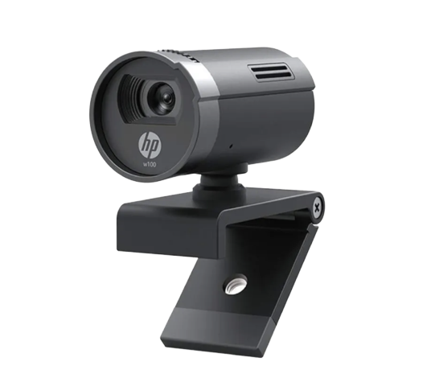
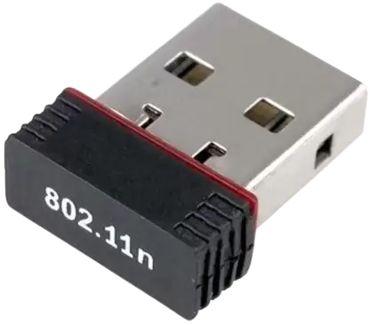
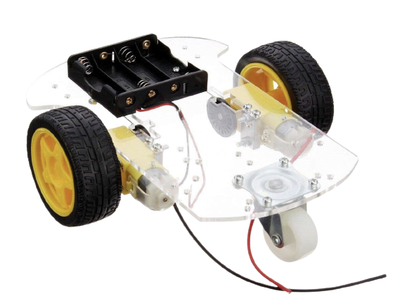

<h1 align="center">TrackerBot: Object Tracking and Collision Avoidance using UGV</h1>

> **Abstract:** *Autonomous rovers are mobile robots, designed to operate in various conditions without any human intervention. These rovers are equipped with sensors, actuators, and control systems that enable them to navigate and interact with their environment. They are widely employed in fields like exploration, search and rescue, environmental monitoring, and surveillance. This research presents the construction and development of an autonomous rover that integrates parallel object tracking, videography, and collision avoidance. The proposed system is designed to operate in real-world scenarios where the rover can navigate safely and capture high-quality visual data of its targeted moving object which can be a living or non-living thing. The rover's control system is based on a combination of classical controllers such as PID controller accompanied by computer vision techniques, enabling it to detect and track objects at a parallel level in its environment, avoid obstacles and collisions, and record video footage with minimal hardware requirements. The proposed system's performance will be evaluated through extensive testing, where the rover's ability to navigate complex environments and capture high-quality visual data will be assessed.*

<h2>TrackerBot Rover</h2>

The TrackerBot Prototype (STL files available <a href= "https://github.com/abhimanyubhowmik/TrackerBot/blob/main/Hardware_Simulation/Rover.stl">here</a>) 

<h2>Components</h2>

<table>
  <tr >
    <td width=25%>  (a) </td>
    <td width=25%>  (b) </td>
    <td width=25%>  (c) </td>
    <td width=25%>  (d) </td>
  </tr>
  <tr>  
    <td width=25%>  (e) </td>
    <td width=25%>  (f) </td>
    <td width=25%>  (g) </td>
    <td width=25%>  (h) </td>
  </tr>
    <tr>  
    <td width=25%>  (i) </td>
    <td width=25%>  (j) </td>
    <td width=25%>  (k) </td>
    <td width=25%>  (l) </td>
  </tr>
</table>

(a) Ardunio Uno (2x), (b) Nvdia Jetson Nano (a), (c) L298 Motor Driver, (d) LM393 IR Speed Sensor (2x), (e) 128x32 OLED I2C Display, (f) HC-SR04 Ultrasonic Distence Sensor (2x), (g) HP W100 480p/30 fps Webcam, (h) 802.11n WIFI Adapter, (i) 2 Wheel Car Robot Chassis with Motors, (j) 0.5 m Power Sharing USB A to USB B Cable for Arduino UNO (2x) (k) AA Battery (8x), (l) 5V ~ 3A Raspberry Pi 3 Power adapter (micro USB charging) 

<h2>Overall Framework</h2>

<h3>1. ROS Architecture</h3>
 

Conceptual view of the ROS architecture 

<h3>2. Power System</h3>

 

The overall power supply chain in the AGV 

<h3>3. Navigation Module</h3>
 

<table>
  <tr>
    <td width="50%">  (a) </td>
    <td width="50%">  (b) </td>
  </tr>
</table>

(a), (b) Detailed diagram of the basic Navigation module (left) The overall schematic architecture of Navigation Module (right).

 

<h3>2. Obstacle Avoidance System</h3>

 

TThe overall schematic architecture of the Obstacle Detection module in
Autonomous Ground Vehicle 

## Results:

https://github.com/abhimanyubhowmik/TrackerBot/assets/72135456/eaed8dc8-102f-4198-b432-6f4fb06c4e33

https://github.com/abhimanyubhowmik/TrackerBot/assets/72135456/fcdceb95-c8d1-49dd-a1ec-9609045fa937

  

## Quick Links:

 
 

## References Used:
- https://github.com/vinay-lanka/navbot_hardware
- https://github.com/leggedrobotics/darknet_ros
- https://github.com/ros-drivers/usb_cam
- https://pypi.org/project/filterpy/1.1.0/

